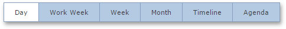
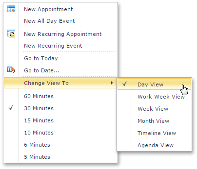
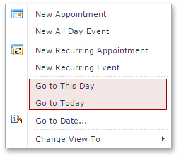
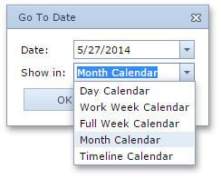

# Switch Scheduler Views
The Scheduler is intended to display appointment data using one of the standard **Views**.

The following views are currently available:
* **Day view**
	
	This view gives the most detailed view of appointments for a certain day(s).
* **Work-Week view**
	
	This view displays appointments for the working days in a particular week.
* **Full Week view**
	
	 This view displays appointments for the entire week.
* **Month (also called Multi-Week) view**
	
	 The month view is the least detailed of the views, and is designed for browsing and long-term plan analysis. This view positions the days one after another horizontally, so that they form weeks, while weeks are placed one under another.
* **Timeline view**
	
	 This view plots appointments as horizontal bars along the timescales, and provides a clearer overview for scheduling purposes.
* **Agenda view**
	
	 This view displays a chronological list of appointments grouped by day.

To switch views, you may use either a special **View Selector** element, or the context menu.
* The **View Selector** element may look like this:
	
	
	
	When a particular view is disabled, the corresponding item is not shown.
* The context menu is invoked when you right-click any region of the **Scheduler** control not occupied with an appointment. You can also click on a free area, wait until the smart tag appears, and then click it.
	
	The invoked menu contains items for switching views, as illustrated in the following picture (the menu in the picture is specific for the **Day View**):
	
	
	
	The context menu also includes such date navigation commands as **Go to Today** and **Go to This Day**. The latter is available only in the **Week View** and **Month View** views. These commands switch the Scheduler to the **Day View**.
	
	
* While navigating dates via the **Go to Date** dialog, you can specify a view type to display a new time interval. The following picture illustrates selecting the View type:
	
	
* The Scheduler selects a view mode **automatically** based on the date range selected in the **Calendar**.
	To learn more about this capability, refer to the [Navigate Time Cells and Dates in the Scheduler](../selection-and-navigation/navigate-time-cells-and-dates-in-the-scheduler.md) topic.