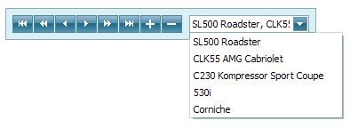

# Navigate Scheduler Resources
When appointment data is [grouped](../layout-customization/scheduler-grouping.md) (either by resources or by dates), the number of resources shown on the screen within the scheduler simultaneously can make it difficult to see all the scheduled data. To make the layout more readable, it is possible to limit the number of visible resources, and then scroll between them. In these cases, use the **Resource Navigator** embedded into the Scheduler.

The Resource Navigator displays a set of buttons used to navigate to the first or last element, previous or next resource, or page. Plus and minus buttons are used to increase or decrease the number of resources displayed at once. The combo box allows you to select the resource to display (or the first resource to display if the page shows several resources at one time).

