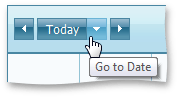
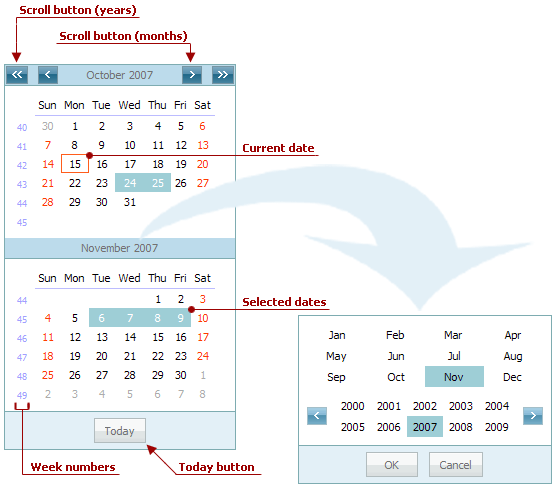
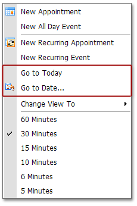
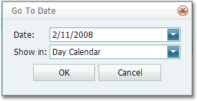

# Navigate Time Cells and Dates in the Scheduler
## View Navigator
To navigate dates, you can use the **View Navigator** shown below.

Use the left and right arrow buttons to go to the previous or next time interval (next day, week, month, depending on the currently visible date interval). The **Today** scrolls the view to locate the current date.

## Calendar
The **Calendar** control is designed specifically for the date navigation and selection task. It is shown in the following picture.

> [!NOTE]
> The availability of the Calendar depends on the application vendor.

You are able to select either a particular date, or a range of dates by means of the Calendar, or directly in the Scheduler's time cell grid.  Selecting dates using the Calendar results in displaying them by the Scheduler, to which it is linked.

The methods of selecting dates are listed below:

&nbsp;
* **Using the Calendar control**
	
	| Action | Effect |
	|---|---|
	| Click any date in the Calendar. | One day becomes selected, and the Scheduler displays it using the **Day View**. If the currently active view is of another type, it is automatically changed to **Day View**. The only exception is the **Work Week View**. In this instance, the entire work week is selected. |
	| Click and drag across the Calendar | The continuous range of dates is selected. The Scheduler adjusts the currently active view to display the selected range of dates. If the selection is smaller than a week, the view type is switched to **Day View**. A week-long range is displayed using the **Week View**. If the range is more than a week, then the **Month View** is used. |
	| Hold down the CTRL key and click several dates. | A set of dates is selected. The Scheduler displays it using the **Day View**, irrespective of the size of the selected range. |
	| Click a week number in the Calendar | A corresponding week-long range is selected. The Scheduler displays it using the **Week View**. |
* **Using the Scheduler control**
	
	| Action | Effect |
	|---|---|
	| Click any date in the Scheduler (if the currently active view is set to either the Week View or the Month View). | One day is selected. |
	| Click and drag across the time cells (in the Week View or Month View only). | A continuous range of dates is selected. The selected range in the Calendar control is not affected, although it goes along with the range displayed within the Scheduler. |

## Context Menu
The popup (context) menu provides the capability to navigate to a particular date.

## "Go to Date" Dialog
If the **Go to Date...** menu item is selected, the **Go to Date** form is invoked.

It enables you to select the date and the view to which the scheduler switches to display the date.