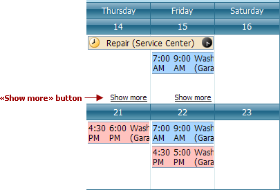

# Scheduler 'More' Buttons
The "More"  buttons are used to show more appointments for a particular day by scrolling to the next appointment. They may appear in the **Day View** and **Work-Week View**.

**Week View** and **Month (Multi-Week) View** present another visual representation of these elements. They indicate that particular dates have more appointments than the view can display (due to insufficient space laid out for day cells). The "Show more" hyperlink appears in these instances. Clicking this hyperlink shows the selected date using the **Day View**, enabling you to scroll the cells and review hidden appointments.

The "Show more" buttons are showin in the following image.

