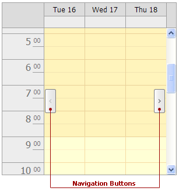

# Scheduler Navigation Buttons
The **Navigation Buttons** are used to scroll to the previous or next appointment. This feature is helpful when there is a significant time interval between scheduled appointments.

A disabled button indicates that there is no appointment in that direction, i.e. before  or after that date. The buttons can be smart enough to be displayed only when there are no appointments in the currently visible interval.