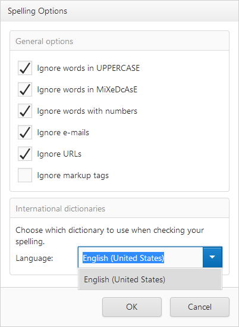

# Spell Checker
The Spell Checker provides the capability to check spelling and correct mistakes in a text.

To start the check, click **Check Spelling...**.

> [!NOTE]
> An action required to start checking depends on your application vendor.

The spell checker compares words in the text with words in the dictionaries. If the spell checker cannot find a word in the dictionaries, a **Check Spelling** window appears. The spell checker highlights words which are not in the dictionaries and suggests a list of alternates. To correct the current word, choose the right version from a list and click **Change**. Click **Change All** to correct this word in the entire text. To ignore the current word, click **Ignore Once**. To ignore this word in the entire document, click **Ignore All**.

To add a new word to a custom dictionary, click **Add To Dictionary**. A capability to add words to a custom dictionary depends on your application vendor.

## Options
### General Options

Spell checker options allow you to ignore emails, URLs, mixed case/upper-case words, markup tags and words with numbers. Select required options from a list.

### Dictionaries

Choose the required language in the drop-down list.

