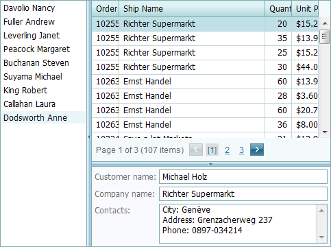

# Splitter
**Splitter** is used to separate the content of a web page into several resizable panes.

This section contains topics that describe how to work with **Splitter**:

* [Expand or Collapse a Pane](splitter/expand-or-collapse-a-pane.md)
* [Resizing a Pane](splitter/resizing-a-pane.md)