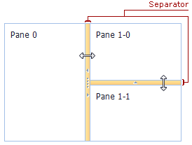

# Resizing a Pane
To resize a pane, place the mouse pointer over the separator (vertical or horizontal) until a double-sided arrow appears. When the arrow appears, drag the separator to the required side.

