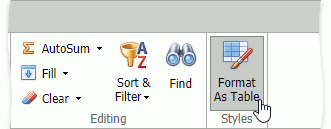
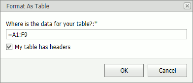

# Format As Table
Do the following to convert a range of cells to a table with its own style:
* Select the  cell range.
* In the **Home** tab's **Styles** group, click the **Format As Table** drop-down button and select the style. 

A **Format As Table** dialog box appears.

* Select the **My table has headers** checkbox if your table has headers and click **OK**.
