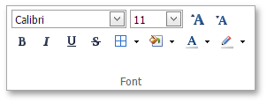
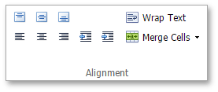
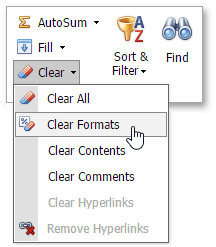

# Format Cell Content
The **Spreadsheet** provides the capability to set the font style, size, color and text alignment in a cell.

To format cell content, follow the steps below.
1. [Select](../editing-cells/select-cells-or-cell-content.md) a cell or a cell range that you wish to format.
2. To change the font, use the **Font** group within the **Home** tab to specify the font family, size, style, color, etc.
	
	
3. To position text within a cell so that it is centered, aligned to the left or aligned to the right, select the appropriate alignment options in the **Alignment** group within the **Home** tab.
	
	
4. To undo the formatting options you applied before, select the text. In the **Editing** group within the **Home** tab, click the **Clear** drop-down and select the **Clear Formats** item.
	
	