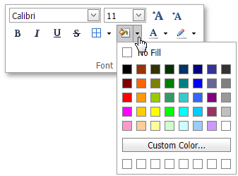

# Format Cells
The **Spreadsheet** provides the capability to format cells and the data they contain.

To format a cell or a range of cells, follow the instructions below.
1. [Select](../editing-cells/select-cells-or-cell-content.md) the cells you wish to format.
2. To add borders to the selected cells, in the **Font** group within the **Home** tab, click the **Borders** button's drop-down menu and select the border type. This menu also allows you to select the line style and the line color of borders.
	
	
3. To set the background color of the selected cells, in the **Font** group within the **Home** tab, click the **Fill Color** button's drop-down menu and select the desired color.
	
	