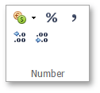
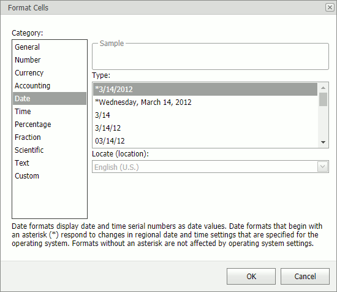
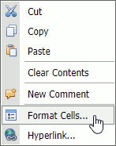

# Number Formatting
The **Spreadsheet** allows you to format numbers in cells, for example, display numbers as monetary values or dates. The default format for cell content is _General_. The format does not change the value, it only changes the way the number is displayed. Number format options are available in the **Home** tab's **Number** group.

You can click one of the buttons in the **Number** group to apply a format, such as **Accounting Number Format**, **Percent Style** or **Comma Style**.

You can also use the **Format Cells** dialog to format numbers. 

To invoke this dialog, click the dialog box launcher at the bottom right corner of the **Number** group or right-click the cell and select **Format Cells...**.

## Shortcuts

You can use the following shortcuts to apply a number format:

|  |  |
|---|---|
| CTRL+SHIFT+1 | Applies the Number format with two decimal places. |
| CTRL+SHIFT+2 | Applies the Time number format. |
| CTRL+SHIFT+3 | Applies the Date format. |
| CTRL+SHIFT+4 | Applies the Currency format. |
| CTRL+SHIFT+5 | Applies the Percentage format. |
| CTRL+SHIFT+6 | Applies the Scientific number format. |
