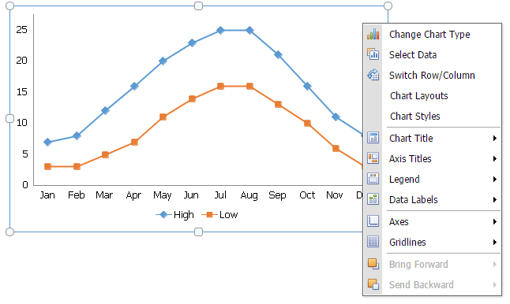
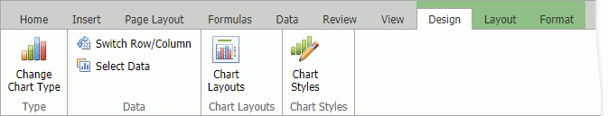
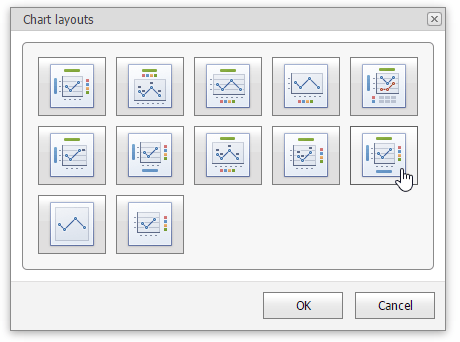
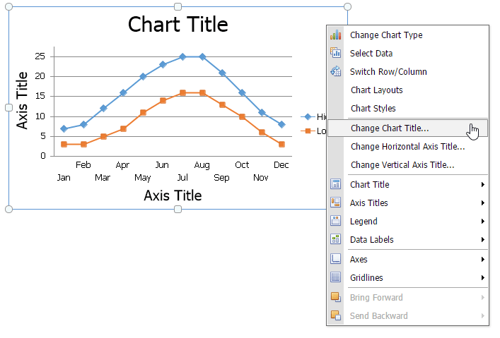
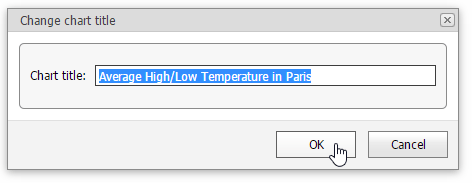
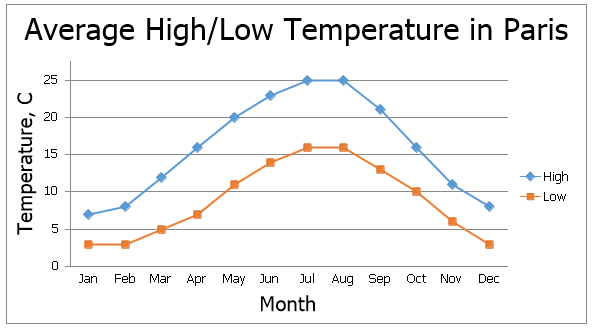
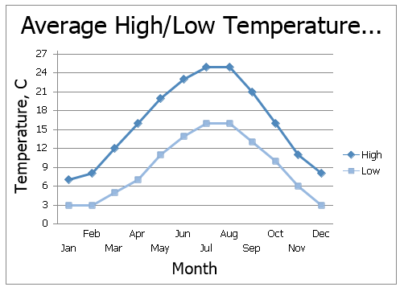

# Applying a Predefined Chart Layout and Style
The **Spreadsheet** allows you to change the appearance of the existing chart by applying one of the predefined layouts and styles.

To change a chart style or layout, right-click the chart you wish to format, then select the appropriate item from the opened context menu to invoke dialog boxes.

When a chart is selected, the Spreadsheet displays context tabs (**Design**, **Layout**, and **Format**) that allows you to customize a chart style or layout.

## Apply a Predefined Chart Layout
In the **Chart Layouts** dialog box, select the required chart layout. For example, select **Layout 10**, which positions the chart legend to the right of the chart area, and adds the chart and axis titles.

To enter the chart title, right-click the chart and select the **Change Chart Title...** item in the context menu.

In the invoked **Change Chart Title** dialog box, enter a title and click **OK**.

To provide horizontal or vertical axis titles, right-click the chart and select the **Change Horizontal Axis Title...** or **Change Vertical Axis Title...** item in the context menu. Type a new title in the invoked dialog box.

The image below shows the result.

## Apply a Predefined Style
Right-click the chart you wish to format and select the **Chart Styles** item within the context menu to invoke a dialog box. In the opened **Chart Styles** dialog box, select the required chart style.

The image below shows a chart with **Style 19** applied.

