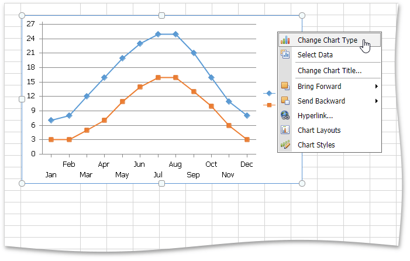
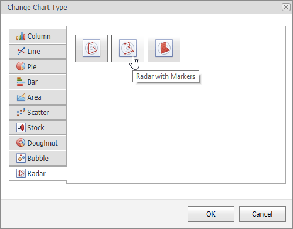

# Changing a Chart Type
The **Spreadsheet** allows you to change the type of the existing chart. To do this, right-click the chart and select the **Change Chart Type** item in the context menu.

In the invoked **Change Chart Type** dialog, select a new chart type and click **OK**.

The following image illustrates the chart with the **Radar with Markers** chart type applied.

