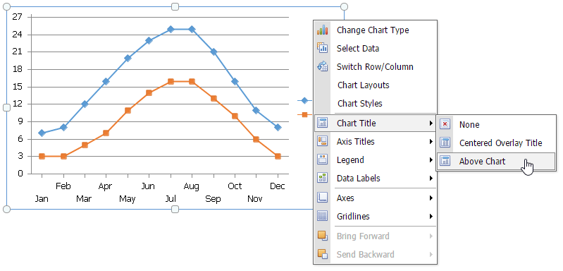
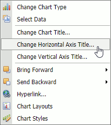
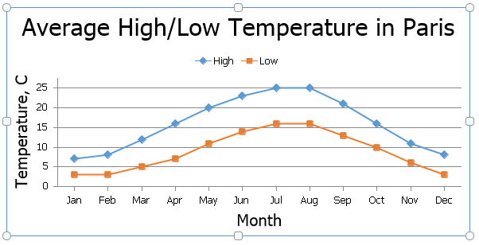
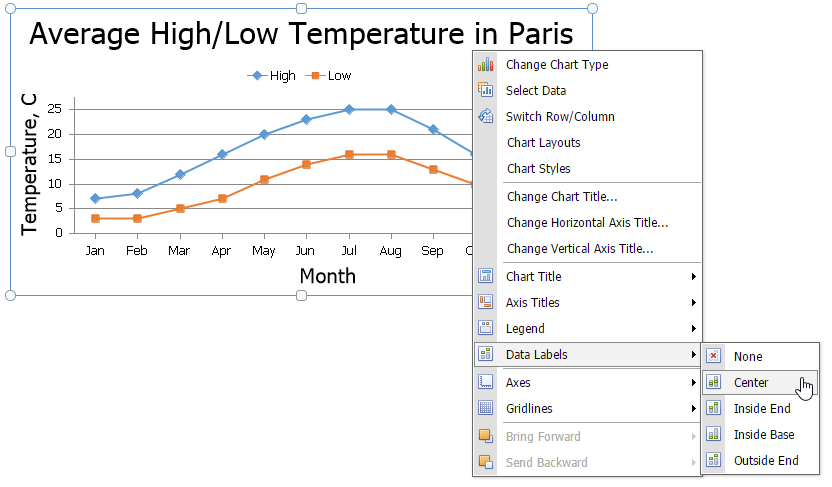
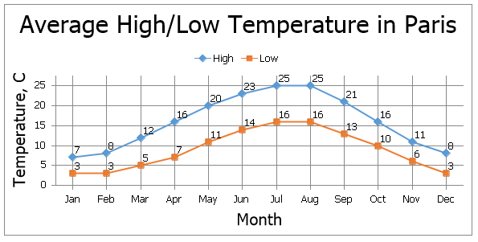

# Modifying a Chart Manually
After you create a chart, you can choose whether to apply one of the [predefined chart layouts](applying-a-predefined-chart-layout-and-style.md) or specify your own layout. The **Spreadsheet** provides the capability to [add axis titles](#axis) and [chart titles](#titles), [show the chart legend](#legend), [display gridlines](#gridlines) and [data labels](#labels), etc.

To modify a chart, right-click it to display the context menu and select the required item or use commands provided by the **Design**, **Layout**, and **Format** context tabs that are displayed in the ribbon when a chart is selected.

## <a name="titles"/>Add a Chart Title
To add a title, select the chart and click the **Chart Title** command in the **Labels** group on the **Layout** context tab. Then, select where to position the chart title. For example, select the **Above Chart** item to display the title at the top of the chart.

The image below illustrates the result.

To change the default text in the title, right-click the chart and select the **Change Chart Title...** item in the context menu. Specify a new chart title in the invoked **Change Chart Title** dialog box.

## <a name="axis"/>Add Axis Titles
To display horizontal and vertical axis titles, click the **Axes Titles** button in the **Labels** group on the **Layout** context tab and do the following:
* To add a horizontal axis title, select the **Primary Horizontal Axis Title** item, and then click the **Title Below Axis** item.
	

* To add a vertical axis title, select the **Primary Vertical Axis Title** item, and then select the type of axis title (rotated, vertical or horizontal) you wish to display.
	

To change the default text in the axis title, right-click the chart and select the **Change Horizontal Axis Title...** or **Change Vertical Axis Title...** item in the context menu. 

Type a new title in the invoked dialog box.

## <a name="legend"/>Add a Chart Legend
To add a legend to the chart, click the **Legend** button in the **Labels** group on the **Layout** context tab and select where to position the legend.

For example, select the **Show Legend at Top** item to display the legend above the plot area.

## <a name="labels"/>Display Data Labels
To display data values on the chart, click the **Data Labels** button in the **Labels** group on the **Layout** context tab and select where to position the data labels.

## <a name="gridlines"/>Add Gridlines
To display chart gridlines, click the **Gridlines** button in the **Axes** group on the **Layout** context tab and select the required gridlines options from the drop-down list.

A chart with horizontal and vertical gridlines is shown below.

