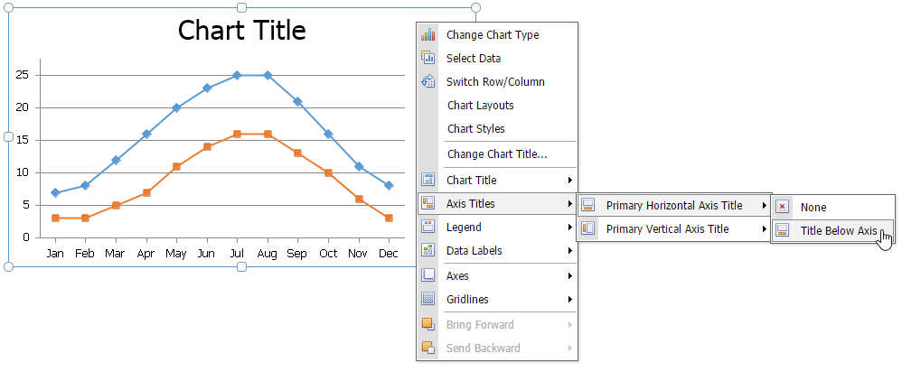

After you create a chart, you can choose whether to apply one of the [predefined chart layouts](../../../../interface-elements-for-web/articles/spreadsheet/charting/applying-a-predefined-chart-layout-and-style.md) or specify your own layout. The **Spreadsheet** provides the capability to [add axis titles](#axis) and [chart titles](#titles), [show the chart legend](#legend), [display gridlines](#gridlines) and [data labels](#labels), etc.

To modify a chart, right-click it to display the context menu and select the required item.

## <a name="titles"/>Add a Chart Title
To add a title to your chart, right-click this chart and select the **Chart Title** item in the context menu. Then, select where to position the chart title. For example, select the **Above Chart** item to display the title at the top of the chart.

The image below illustrates the result.

To change the default text in the title, right-click the chart and select the **Change Chart Title...** item in the context menu. Specify a new chart title in the invoked **Change Chart Title** dialog box.

## <a name="axis"/>Add Axis Titles
To display horizontal and vertical axis titles, right-click the chart and select the **Axis Titles** item in the context menu and do the following.
* To add a horizontal axis title, select the **Primary Horizontal Axis Title** item, and then click the **Title Below Axis** item.
	
	
* To add a vertical axis title, select the **Primary Vertical Axis Title** item, and then select the type of axis title (rotated, vertical or horizontal) you wish to display.
	
	

To change the default text in the axis title, right-click the chart and select the **Change Horizontal Axis Title...** or **Change Vertical Axis Title...** item in the context menu. Type a new title in the invoked dialog box.

## <a name="legend"/>Add a Chart Legend
To add a legend to the chart, right-click the chart and select the **Legend** item in the context menu. Then, select where to position the legend.

 

For example, select the **Show Legend at Top** item to display the legend above the plot area.

## <a name="labels"/>Display Data Labels
To display data values on the chart, right-click the chart and select the **Data Labels** item in the context menu. Then, select where to position the data labels.

## <a name="gridlines"/>Add Gridlines
To display chart gridlines, right-click the chart and select the **Gridlines** item in the context menu and do one of the following.
* To add horizontal gridlines, select the **Primary Horizontal Gridlines** item, and then select the type of gridlines you wish to display.
	
	
* To add vertical gridlines, select the **Primary Vertical Gridlines** item, and then select the type of gridlines you wish to display.
	
	

A chart with horizontal and vertical gridlines is shown below.

