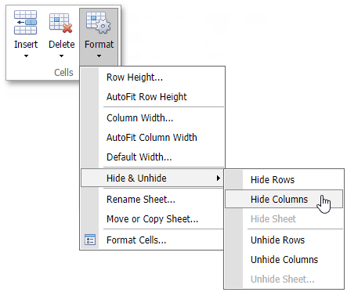
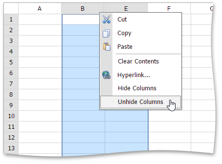
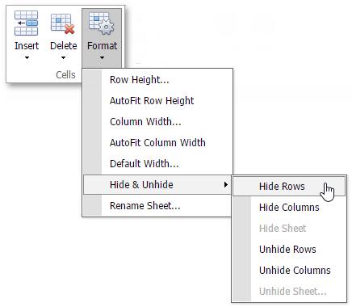
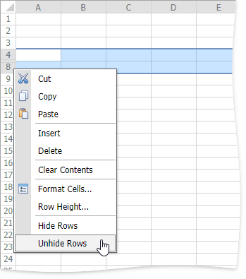

# Show and Hide Columns and Rows
The **Spreadsheet** provides the capability to display and hide columns and rows in a worksheet.

## Hide and Unhide Columns
To hide a column, [select](../editing-cells/select-cells-or-cell-content.md) the column to be hidden and do one of the following.
* Set the column width to zero. To do this, drag the boundary of the column heading until the column is hidden.
* On the **Home** tab, in the **Cells** group, click the **Format** button and select **Hide &amp; Unhide | Hide Columns**.
		

* Right-click the selected column and select the **Hide Columns** item from the context menu.

To show a hidden column, select the columns adjoining either side of the hidden column, and then do one of the following.
* On the **Home** tab, in the **Cells** group, click the **Format** button, and then select **Hide &amp; Unhide | Unhide Columns**.
* Right-click the selected columns and select the **Unhide Columns** item from the context menu.
		

## Hide and Unhide Rows
To hide a row, select the row to be hidden and do one of the following.
* Set the row height to zero. To do this, drag the boundary of the row heading until the row is hidden.
* On the **Home** tab, in the **Cells** group, click the **Format** button and select **Hide &amp; Unhide | Hide Rows**.
		

* Right-click the selected row and select the **Hide Rows** item from the context menu.

To display a hidden row, select the rows that are above and below the hidden row, and then do one of the following.
* On the **Home** tab, in the **Cells** group, click the **Format** button, and then select **Hide &amp; Unhide | Unhide Rows**.
* Right-click the selected rows and select the **Unhide Rows** item from the context menu.
		

## Display all hidden columns and rows
1. Press CTRL+A to select all rows and columns.
2. On the **Home** tab, in the **Cells** group, click the **Format** button, and then select **Hide &amp; Unhide | Unhide Rows** or **Unhide Columns**.