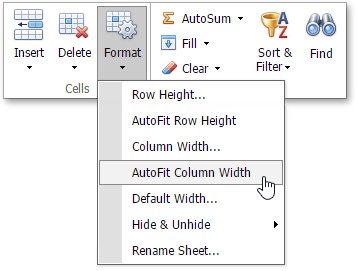
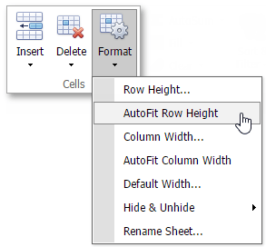

# Specify Column Width and Row Height
## Set the column width
The column width should be between 0 and 1785 points. Set a column's width to 0 to hide this column.

You can change the column width in the following ways:
* Drag the right boundary of a column heading to resize the column's width. To set multiple columns' width, select the columns and drag the right boundary of any selected column.
* Select a column and click the **Format** button in the **Home** tab's **Cells** group. Select the **Column Width...** command. Specify the column's width in the dialog box.
* Right-click a column heading and select **Column Width...** in the context menu. Specify the column's width in the dialog box.

To make the column width to automatically fit the contents, do one of the following:
* Select a column and click the **Format** button in the **Home** tab's **Cells** group. Select the **AutoFit Column Width** command in the drop-down list.
* Double-click a column heading's right border.
	
	

## Set the row height
The row height should be between 0 and 546 points. Set a row's height to 0 to hide this row.

You can change the row height as follows:
* Drag the lower boundary of a row heading to resize the row's height. To set multiple rows' height, select the rows and drag the lower boundary of any selected row.
* Select a row and click the **Format** button in the **Home** tab's **Cells** group. Select the **Row Height...** command. Specify the row's height in the dialog box.
* Right-click a row heading and select the **Row Height...** in the context menu. Specify the row's height in the dialog box.

Do one of the following to make the row height automatically fit its contents:
* Select a row and click the **Format** button in the **Home** tab's **Cells** group. Select the **AutoFit Row Height** command in the drop-down list.
* Double-click a row heading's bottom border.
	
	
