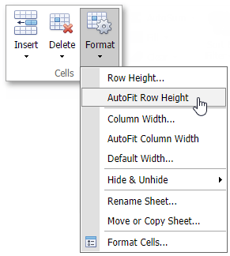

# Specify Column Width and Row Height
## Set the column width
In the **Spreadsheet**, the column width should be between zero and 1785 points. If you set the column width to zero, the column will be hidden.

To change the column width, do one of the following.
* Drag the right boundary of the column heading to resize the column width. To set the width of multiple columns, select these columns, and then drag the right boundary of any selected column.
* Select a column and click the **Format** button on the **Home** tab in the **Cells** group. Then, select the **Column Width...** command. Specify the column's width in the displayed dialog box.
* Right-click a column heading and select the **Column Width...** command in the displayed context menu. Specify the column's width in the displayed dialog box.

To change the column width to automatically fit the contents, do one of the following.
* Select the column and click the **Format** button on the **Home** tab in the **Cells** group. Then, select the **AutoFit Column Width** item from the drop-down list.
* Double-click a column heading's right border.
	
	

## Set the row height
In the **Spreadsheet**, the row height should be between zero and 546 points. If you set the row height to zero, the row is hidden.

To change the row height, do one of the following.
* Drag the lower boundary of the row heading until the row is the height you want. To set the height of multiple rows, select them, and then drag the lower boundary of any selected row.
* Select a row and click the **Format** button on the **Home** tab in the **Cells** group. Then, select the **Row Height...** command. Specify the row's height in the displayed dialog box.
* Right-click a row heading and select the **Row Height...** command in the displayed context menu. Specify the row's height in the displayed dialog box.

To change the row height to automatically fit the contents, do one of the following.
* select the row and click the **Format** button on the **Home** tab in the **Cells** group. Then, select the **AutoFit Row Height** item from the drop-down list.
* Double-click a row heading's bottom border.
	
	