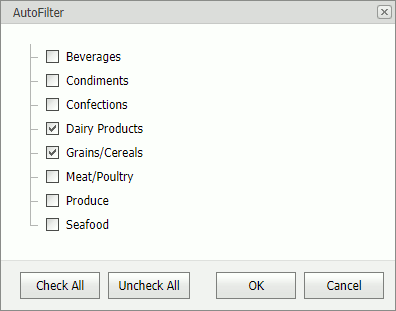
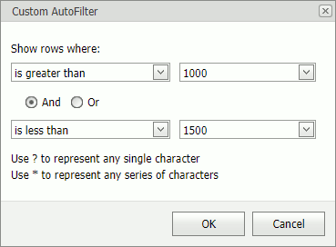
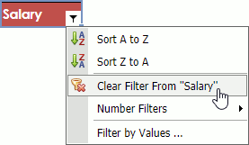

# Filtering
Use commands in the **Data** tab's **Sort & Filter** group to activate filtering, reapply a filter, or remove all the filters in a worksheet.

Select a table and click the **Filter** button to enable filtering. Click the arrow in a column's header to apply a filter to the column.

## Apply a Filter
To filter a column by particular values, click the arrow in the column header and select **Filter by Values...**. This invokes a dialog box with a list of column values.

Select/unselect check boxes to display/hide values.

To apply a custom filter, click the arrow in a column header, select **Text Filters** command, and select one of predefined filters. This invokes the **Custom AutoFilter** dialog box. Specify a criteria operator and an operand value and click **OK**.

> [!NOTE]
> The **Text Filter** menu's name and content depends on the type of data in the filtered column (text, numeric values or dates).

## Clear Filter
Click the arrow in a column's header and select **Clear Filter From "ColumnName"** to clear the column's filter.

Click the **Clear** button in the **Data** tab's **Sort & Filter** group to clear all the filters.

## Reapply Filter
New or modified data in a column is not filtered automatically. Click the **Reapply** button to reapply the filter.
