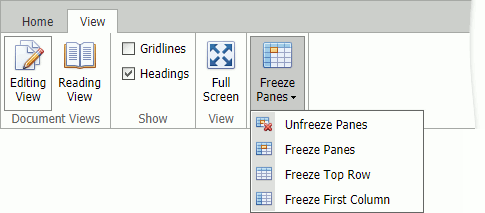

# Freeze Panes
You can lock specific rows or columns to display this area while scrolling the worksheet.

The **Unfreeze Panes** command cancels the applied freezing.

The **Freeze Panes** command freezes columns to the left of the selected cell(s) and rows above the selected cell(s).

The **Freeze Top Row** command freezes the top row.

The **Freeze First Column** command freezes the first column.
