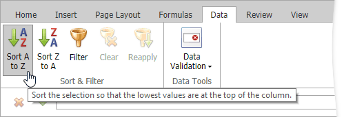

# Sort Data
The **Spreadsheet** provides the capability to sort data by text (**A to Z** or **Z to A**), numbers (**smallest to largest** or **largest to smallest**), dates and times (**oldest to newest** or **newest to oldest**) in one column.

To perform sorting, do the following.
1. Select a range in the column you wish to sort.
	
	> [!NOTE]
	> If multiple columns are selected, the range will be sorted by the **first** column.
2. On the **Data** tab, in the **Common** group, click **Sort A to Z** to select ascending order, or click **Sort Z to A** for descending order.
	
	