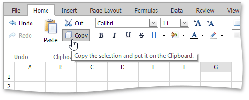
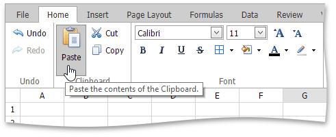

# Copy and Paste Cell Content
The **Spreadsheet** allows you to copy and paste entire cells, or only their contents, using the Clipboard.

> [!NOTE]
> Note that you can use Clipboard only in IE. For other browsers, use the keyboard shortcuts Ctrl+C, Ctrl+X and Ctrl+V to copy, cut and paste respectively.

To move or copy cell content, follow the steps below.
1. [Select](select-cells-or-cell-content.md) the cells that you wish to move or copy.
2. In the **Clipboard** group within the **Home** tab, do one of the following.
	* To move the selected cells, click the **Cut** button (or press CTRL+X or SHIFT+DELETE).
		
		
	* To copy the selected cells, click the **Copy** button (or press CTRL+C or CTRL+INSERT).
		
		
3. Click the upper-left cell in the area where you wish to paste the copied cells.
4. In the **Clipboard** group within the **Home** tab , click the **Paste** button (or press CTRL+V or SHIFT+INSERT).
	
	