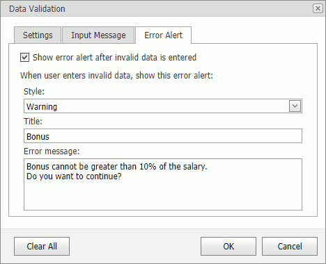

# Data Validation

## Data Validation Overview
Data validation allows you to restrict data that can be entered into a cell. It prevents users from entering wrong values. You can provide messages to explain the reason for the restriction or to instruct users how to correct errors.

You can access validation settings in the **Data Tools** group on the **Data** ribbon tab.

## Data Validation Settings
To define data validation rules, do the following:
* Select cells for which you specify rules.
* Click the **Data Validation** button and select the **Data Validation** command. A **Data Validation** dialog box appears.

* On the **Settings** tab specify the required validation criteria. 
* Click **OK**.

## Data Validation Message
A data validation message is displayed when a cell is focused.

To display a message, do the following:
* Select cells for which the message will be displayed.
* Click the Data **Validation** button and select the **Data Validation** command. A **Data Validation** dialog box appears.
* On the **Input Message** tab select the **Show input message when cell is selected** check box.
* Specify a message title and text.
* Click **OK**.

## Data Validation Error Alert
A data validation error alert is displayed when user enters invalid data.

To display an alert, do the following:
* Select cells for which the alert will be displayed.
* Click the **Data Validation** button and select the **Data Validation** command. A **Data Validation** dialog box appears.
* On the **Error Alert** tab select the **Show error alert after invalid data is entered** check box.
* Select an alert style and specify a title and text.
* Click **OK**.

## Circle Invalid Data
To circle invalid data, click the **Data Validation** button and select the **Circle Invalid Data** command.

To hide the circles, click the **Data Validation** button and select the **Clear Invalid Data** command.

