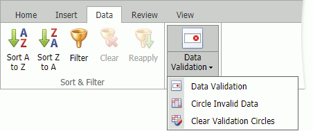
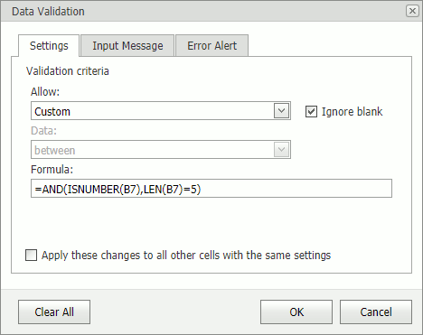
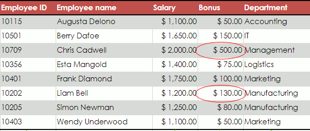

# Data Validation

## Data Validation Overview
Data validation allows you to restrict data that can be entered into a cell. It prevents users from entering wrong values. You can provide messages to explain the reason for the restriction or to instruct users how to correct errors.

You can access validation settings in **Data** tab's **Data Tools** group.

## Data Validation Settings
You can define data validation rules as follows:
* Select cells for which you specify rules.
* Click **Data Validation** and select the **Data Validation** command in drop-down list. This invokes the **Data Validation** dialog box.

* Specify validation criteria on the **Settings** tab. 
* Click **OK**.

## Data Validation Message
A data validation message is displayed when a cell is focused.

To display a message, do the following:
* Select cells for which a message will be displayed.
* Click **Data Validation** and select the **Data Validation** command in drop-down list. This invokes the **Data Validation** dialog box.

* Select the **Show input message when cell is selected** check box on the **Input Message** tab. 
* Specify a message's title and text.
* Click **OK**.

## Data Validation Error Alert
A data validation error alert is displayed when a user enters invalid data.

To display an alert, do the following:
* Select cells for which the alert will be displayed.
* Click **Data Validation** and select the **Data Validation** command in drop-down list. This invokes the **Data Validation** dialog box.

* Select the **Show error alert after invalid data is entered** check box on the **Error Alert** tab.
* Select an alert style and specify its title and text.
* Click **OK**.

## Circle Invalid Data
Click **Data Validation** and select the **Circle Invalid Data** command in drop-down list to circle invalid data.

Click **Data Validation** and select the **Clear Invalid Data** command to hide circles.

