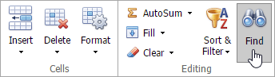
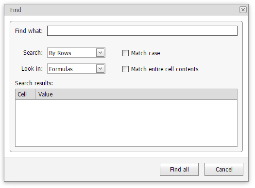

# Find and Replace
The **Spreadsheet** allows you to search for specific data in the current worksheet. To perform a search, on the **Home** tab, in the **Editing** group, click the **Find** button or press CTRL+F.

The **Find** dialog will be invoked.

In the **Find what** field, enter the text or number you wish to find, and click the **Find Next** button to start the search. To define the direction of the search, in the **Search** field, select the **By Rows** or **By Columns** drop-down item. In the **Look in** field, select **Values** (to search cell values only) or **Formulas** (to search cell values and formula expressions, excluding the calculated results). To perform a case-sensitive search, select the **Match Case** check box. To restrict the search to the entire cell content, select the **Match entire cell contents** check box.