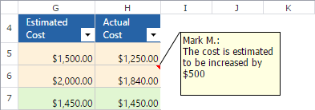
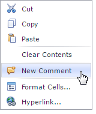
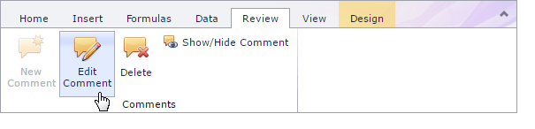
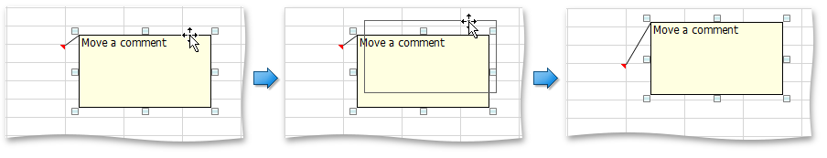
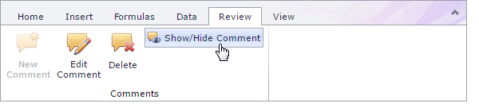
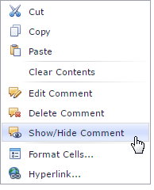
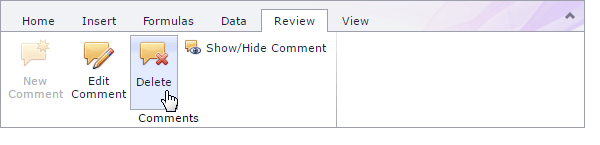
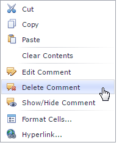

# Comments
The **Spreadsheet** allows you to attach notes to individual cells by using **comments**. Comments are extremely useful when you need to provide additional information, such as reminders, notifications, or feedback in a document without modifying cell content.

Comments are stored separately from a cell and displayed in a floating text box. A cell containing a comment has a red triangular indicator in the corner.
 

You can [add](#add) new comments, [edit](#edit) existing comments, [move and resize](#move) the comment box, [hide](#hide) or [delete](#delete) comments if they are no longer needed.

## <a name="add"/>Add a Comment
To insert a new comment, select the cell where you wish to place the comment, and do one of the following.
* On the **Review** tab, in the **Comments** group, click the **New Comment** button.
	
	
* Right-click the cell and select the **New Comment** item in the context menu.
	
	

## <a name="edit"/>Edit a Comment
To edit an existing comment, select the cell where you wish to modify the comment, and do one of the following.
* On the **Review** tab, in the **Comments** group, click the **Edit Comment** button.
	
	
* Right-click the cell and select the **Edit Comment** item in the context menu.
	
	

## <a name="move"/>Move and Resize a Comment
You can move and resize comment text boxes performing the following instructions.
1. Select the cell that contains the comment you wish to move or resize.
	
	> [!TIP]
	> If the comment is hidden, click the **Show/Hide Comment** button to display the comment.
2. Click the comment box border to display the **sizing handles** (small rectangles at the corners and sides of the comment box).
3. Do one of the following.
	* To move a comment, hover the mouse over the comment border so that the four-way resize arrow appears, and drag the comment to a new location.
		
		
	* To resize a comment, click one of the sizing handles and drag the edge of the comment box.
		
		

## <a name="hide"/>Display or Hide a Comment
To show/hide a comment text box, select the cell that contains the comment you wish to display or hide and do one of the following.
* On the **Review** tab, in the **Comments** group, click the **Show/Hide Comment** button.
		

* Right-click the cell and select the **Show/Hide Comment** item in the context menu.
		

## <a name="delete"/>Remove a Comment
To delete an existing comment, select the cell that contains the comment you wish to delete and do one of the following.
* On the **Review** tab, in the **Comments** group, click the **Delete** button.
		

* Right-click the cell and select the **Delete Comment** item in the context menu.
		
