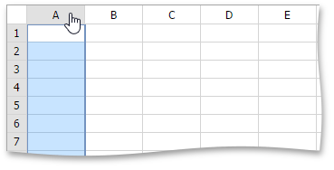
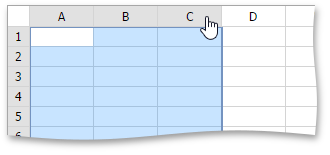
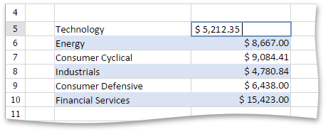

# Select Cells or Cell Content
## Selecting Cells
To select cells in the **Spreadsheet**, use the following mouse actions and keyboard shortcuts.
1. To select a **single cell**, click the cell or press the arrow keys to move to the required cell.
2. To select a **range of cells**, do one of the following.
	* Click the first cell in the range and drag it to the last cell.
	* Hold down the SHIFT key, and then press the arrow keys to extend the selection.
	* Click the first cell in the range, hold down the SHIFT key, and then click the last cell in the range.
3. To select the **entire worksheet**, press CTRL+A.
4. To select **nonadjacent cells**, hold down the CTRL key, and then select other cells.
5. To select an **entire row or column**, click the row or column heading.
	
	
6. To select **multiple columns or rows**, drag across the row or column headings.
	
	
7. To select **several nonadjacent rows or columns**, click the heading of the first row or column in the selection, hold down CTRL, and then click the headings of other rows or columns you wish to select.

## Selecting Cell Content
To select the cell content, double-click the cell, and then drag it across the cell content you wish to select.

