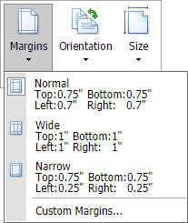
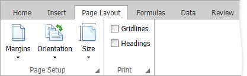

# Adjust Page Settings
Before you print a worksheet, you can change page layout settings such as [page margins](#margins), [page orientation](#orientation), [paper size](#size) and specify whether [gridlines and headings](#print) should be printed in a worksheet. 

## <a name="margins"/>Set Page Margins
1. Click a worksheet for which you wish to set the page margins.
2. In the **Page Setup** group within the **Page Layout** tab, click the **Margins** button and select the margin sizes to be set for the current worksheet.
	
	

## <a name="orientation"/>Set Page Orientation
1. Click a worksheet for which you wish to specify page orientation.
2. In the **Page Setup** group within the **Page Layout** tab, click the **Orientation** button and select **Portrait** or **Landscape** from the invoked drop-down list.
	
	

## <a name="size"/>Change Paper Size
1. Click a worksheet for which you wish to set the paper size.
2. In the **Page Setup** group within the **Page Layout** tab, click the **Size** button and select one of the predefined paper sizes from the invoked drop-down list.
	
	

## <a name="print"/>Print Gridlines and Headings
1. Click a worksheet for which you wish to print gridlines and/or headings.
2. In the **Print** group within the **Page Layout** tab, select the **Gridlines** and/or **Headings** check boxes.
	
	

## Page Setup Dialog
You can specify every page setting in a **Page Setup** dialog. To invoke the dialog, click a dialog box launcher in the bottom right corner of the **Page Setup** or **Print** group.

