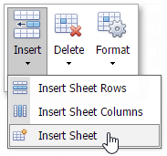
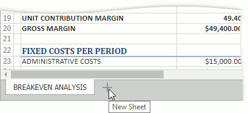
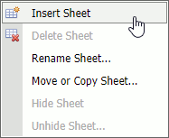

# Create a Worksheet
To create a new worksheet within the current workbook, do one of the following:

* Click the **Insert** button in the **Cells** group on the **Home** tab and select the **Insert Sheet** command from the drop-down list.

* Click a **New Sheet** button displayed next to the last sheet tab.

* Right-click a sheet tab and select the **Insert Sheet** command in the displayed context menu.

* Rress SHIFT+F11.

