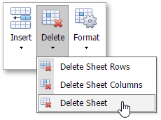
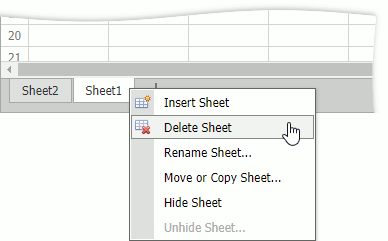

# Delete a Worksheet
To delete a worksheet, do one of the following.
* Switch to the worksheet you want to delete. On the **Home** tab, in the **Cells** group, click the **Delete** button and select the **Delete Sheet** item from the drop-down list.
	
	

* Right-click the sheet tab and select **Delete Sheet** command in the displayed context menu.
