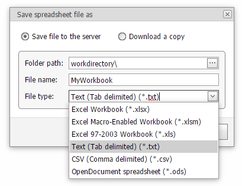

# Import Text Files
The **Spreadsheet** provides the capability to save a workbook as a text file (.txt or .csv).

## Save a Workbook as a Text File
1. To save a workbook as a text file, go to the **File** tab, and in the **Common** group, click the **Save As** button.
	
	
2. In the **Save Spreadsheet File As** dialog box that is invoked, select the **Text (Tab-delimited)** or **CSV (Comma-delimited)** item from the **File type** drop-down list.
	
	

The main features of the tab-delimited and comma-delimited file formats are described below.
* **Tab-delimited text files**
	
	This file format uses the _TAB_ character to separate each field of text. Note that the **Spreadsheet** only saves the active worksheet as a text (.txt) file. The columns are separated by the tab characters and each row ends with a carriage return character. The values and text in cells are saved as they are displayed in a worksheet. If a cell contains a comma, the cell contents are enclosed in double quotation marks. All formatting options applied to the cell, pictures and objects (such as hyperlinks) are lost.
* **Comma-delimited text files**
	
	This file format uses the _comma_ character to separate each field of text. Note that the **Spreadsheet** only saves the active worksheet as a CSV (.csv) file. Columns are separated by commas, and each row ends with a carriage return character. Cell text and values are saved as they are displayed in a worksheet. If a cell contains a comma, cell contents are enclosed in double quotation marks. All formatting options applied to the cell, pictures and objects (such as hyperlinks) are lost.