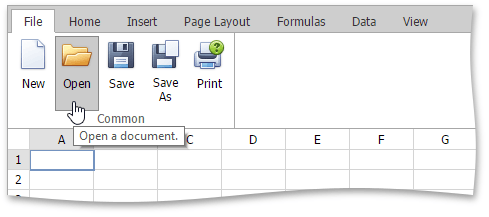
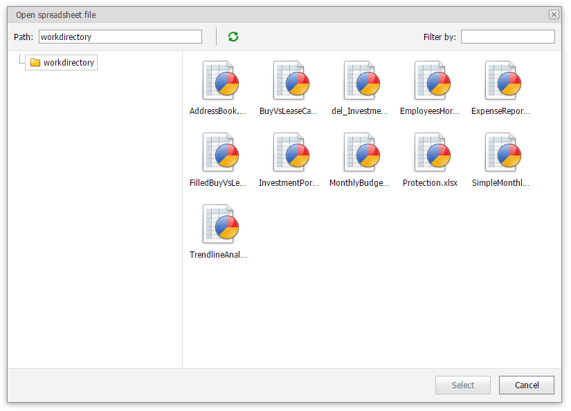

# Load a Workbook
To load a workbook, select the **File** tab, and click the **Open** button in the **Common** group or press CTRL+O. 

In the invoked **Open spreadsheet file** dialog box, select the file you wish to open from your working directory.

The **Spreadsheet** supports the following file formats.
* Excel Workbook (*.xlsx)
* Excel Macro-Enabled Workbook (*.xlsm)
* Excel 97-2003 Workbook (*.xls)
* Tab-delimited Text File format (*.txt)
* Comma-separated Values File format (*.csv)