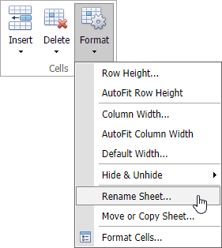
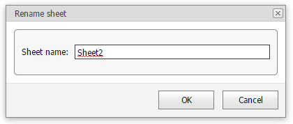

# Rename a Worksheet
When a new worksheet is created, the **Spreadsheet** assigns it a generic name, such as _Sheet1_, _Sheet2_, etc.

To rename a worksheet, do one of the following:

* Click the **Format** button in the **Cells** group on the **Home** tab and select the **Rename Sheet...** item from the drop-down list.

* Right-click the sheet tab and select the **Rename Sheet...** command in the displayed context menu.

* Double-click the sheet tab.

A **Rename Sheet** dialog box appears. Rename the worksheet and click **OK**.

The **Spreadsheet** sets the following rules for a valid worksheet name.
* The maximum length of a worksheet name is 31 characters.
* A worksheet name must not be an empty string.
* A worksheet name must not include the following characters: **\**, **/**, **?**, **:**, *****, **[**, **]**.
* A worksheet name must not start or end with a single quote.
* A worksheet name must not be equal to a name of another existing worksheet.