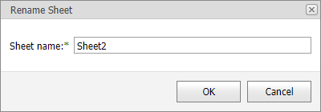

# Rename a Worksheet
When a new worksheet is created, the **Spreadsheet** assigns it a generic name, such as _Sheet1_, _Sheet2_, etc.

To rename a worksheet, go to the **Home** tab, and then in the **Cells** group, click the **Format** button and select the **Rename Sheet** item from the drop-down list.

Rename the worksheet and click **OK** within the invoked dialog box.

The **Spreadsheet** sets the following rules for a valid worksheet name.
* The maximum length of a worksheet name is 31 characters.
* A worksheet name must not be an empty string.
* A worksheet name must not include the following characters: **\**, **/**, **?**, **:**, *****, **[**, **]**.
* A worksheet name must not start or end with a single quote.
* A worksheet name must not be equal to a name of another existing worksheet.