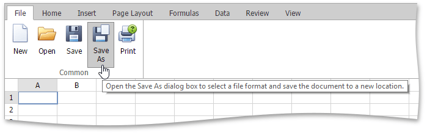

# Save a Workbook
To save a workbook, go to the **File** tab, and then click the **Save as** button in the **Common** group.

After that, the **Save spreadsheet file as** dialog box is invoked.

Specify whether the file should be saved to the server or downloaded as a copy. Then specify the folder path, file name and the file format in which to save the workbook.

The available file formats in the **Save as** dialog box are the following.
* Excel Workbook (*.xlsx)
* Excel Macro-Enabled Workbook (*.xlsm)
* Excel 97-2003 Workbook (*.xls)
* Tab-delimited Text File format (*.txt)
* Comma-separated Values File format (*.csv)

To save the active workbook with its current file format and location, go to the **File** tab, and then click the **Save** button in the **Common** group or press CTRL+S. If you click the **Save** button to save a newly created workbook, the **Save spreadsheet file as** dialog is invoked.