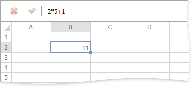

# Create a Simple Formula
The **Spreadsheet** allows you to perform calculations on data in cells using formulas. A formula is a string expression that starts with the equals sign ("="). Formulas can contain constants, math operators, functions, cell references, etc.

You can create and edit formulas directly within cells or in a formula bar.

For example, if you wish to add 1 to the product of 2 and 5, type the following formula in the cell in which you wish to insert the formula.

**=2*5+1**

Press ENTER. The result appears in the cell in which you inserted the formula.

