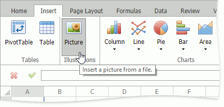

# Insert a Picture
The **Spreadsheet** allows you to insert pictures in a worksheet.

You can insert graphics of the following type.
* Bitmap (*.bmp, *.dib)
* JPEG File Interchange Format (*.jpg, *.jpeg)
* Portable Network Graphics (*.png)
* Graphics Interchange Format (*.gif)

To insert a picture, follow the instructions below.
1. On the **Insert** tab, in the **Illustrations** group, click the **Picture** button.
	
	
2. In the **Insert Image** dialog box that is invoked, enter an image's web address (if you are going to load a picture from the web) or locate the required folder and select a file (if you are going to load pictures from your computer). Click **Insert**. The picture will be inserted into the worksheet.
	
	