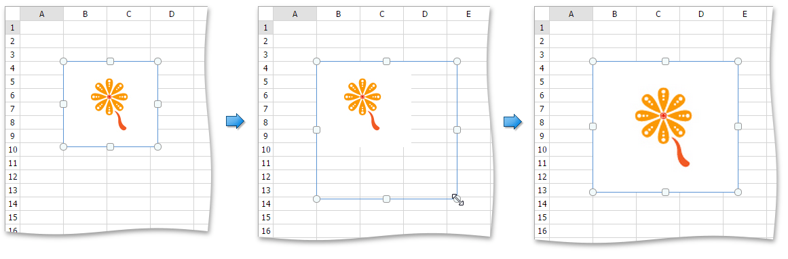

# Move and Resize a Picture
## Move a Picture
1. Click the picture you wish to move.
2. Drag the picture to a new location.

## Resize a Picture
1. Click the picture to be resized.
2. Drag the _sizing handle_ away from the center (or towards the center) of the picture, and release it once the desired size is reached.
	
	

When you change the width of the object by dragging a _corner sizing handle_, the object's height will automatically be changed to maintain the aspect ratio of the object and vice-versa.