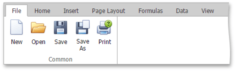
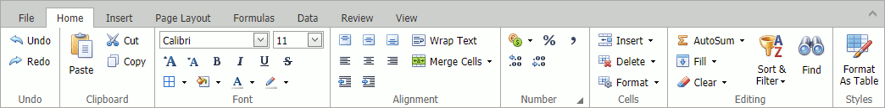
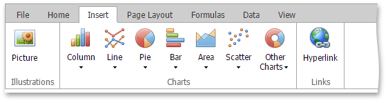
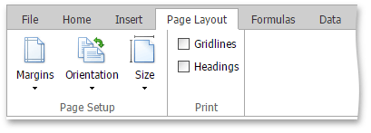
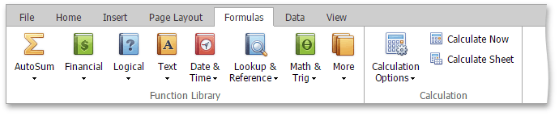
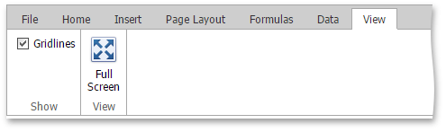

# Ribbon Interface
The comprehensive functionality of the **Spreadsheet** is provided by a set of **Ribbon** pages. Ribbon pages are divided into logical groups that include commands with common features. Use the **Ribbon** interface to perform basic operations in the **Spreadsheet** (to [create](../file-operations/create-a-workbook.md) a workbook, [create](../file-operations/create-a-worksheet.md) or [delete](../file-operations/delete-a-worksheet.md) worksheets, [select](../editing-cells/select-cells-or-cell-content.md) data in a worksheet, navigate through a worksheet, etc.).

## File

[Create a Workbook](../file-operations/create-a-workbook.md)

[Load a Workbook](../file-operations/load-a-workbook.md)

[Save a Workbook](../file-operations/save-a-workbook.md)

[Print a Workbook](../file-operations/print-a-workbook.md)

## Home

[Undo and Redo Last Actions](../file-operations/undo-and-redo-last-actions.md)

[Copy and Paste Cell Content](../editing-cells/copy-and-paste-cell-content.md)

[Format Cells](../cell-formatting/format-cells.md)

[Format Cell Content](../cell-formatting/format-cell-content.md)

[Wrap Text and Merge Cells](../cell-formatting/wrap-text-and-merge-cells.md)

[Number Formatting](../cell-formatting/number-formatting.md)

[Clear Cell Formatting](../cell-formatting/clear-cell-formatting.md)

[Insert and Delete Columns and Rows](../columns-and-rows/insert-and-delete-rows-and-columns.md)

[Show and Hide Columns and Rows](../columns-and-rows/show-and-hide-columns-and-rows.md)

[Specify Column Width and Row Height](../columns-and-rows/specify-column-width-and-row-height.md)

[Fill Data Automatically](../editing-cells/fill-data-automatically.md)

[Find and Replace](../editing-cells/find-and-replace.md)

[Format As Table](../cell-formatting/format-as-table.md)

## Insert

[Insert a Picture](../pictures-and-hyperlinks/insert-a-picture.md)

[Move and Resize a Picture](../pictures-and-hyperlinks/move-and-resize-a-picture.md)

[Charting Overview](../charting/charting-overview.md)

[Creating a Chart](../charting/creating-a-chart.md)

[Changing a Chart Type](../charting/changing-a-chart-type.md)

[Applying a Predefined Chart Layout and Style](../charting/applying-a-predefined-chart-layout-and-style.md)

[Modifying a Chart Manually](../charting/modifying-a-chart-manually.md)

[Insert and Delete Hyperlinks](../pictures-and-hyperlinks/insert-and-delete-hyperlinks.md)

## Page Layout

[Adjust Page Settings](../file-operations/adjust-page-settings.md)

## Formulas

[Create a Simple Formula](../formulas/create-a-simple-formula.md)

[Cell References](../formulas/cell-references.md)

[Using Functions in Formulas ](../formulas/using-functions-in-formulas.md)

[Supported Functions](../formulas/supported-functions.md)

[Error Types in Formulas](../formulas/error-types-in-formulas.md)

## Data

[Sort Data](../data-presentation/sort-data.md)

[Filtering](../data-presentation/filtering.md)

[Data Validation](../editing-cells/data-validation.md)

## Review

[Comments](../editing-cells/insert-a-comment.md)

## View

[Document Views](../viewing/document-views.md)

[Hide and Display Gridlines](../viewing/hide-gridlines.md)

[Hide and Display Headings](../viewing/hide-and-display-headings.md)

[Full Screen Mode](../viewing/full-screen-mode.md)

[Freeze Panes](../data-presentation/freeze-panes.md)