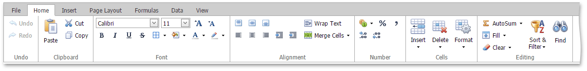
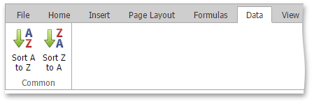

The comprehensive functionality of the **Spreadsheet** is provided by a set of **Ribbon** pages. Ribbon pages are divided into logical groups that include commands with common features. Use the **Ribbon** interface to perform basic operations in the **Spreadsheet** (to [create](../../../../interface-elements-for-web/articles/spreadsheet/file-operations/create-a-workbook.md) a workbook, [create](../../../../interface-elements-for-web/articles/spreadsheet/file-operations/create-a-worksheet.md) or [delete](../../../../interface-elements-for-web/articles/spreadsheet/file-operations/delete-a-worksheet.md) worksheets, [select](../../../../interface-elements-for-web/articles/spreadsheet/editing-cells/select-cells-or-cell-content.md) data in a worksheet, navigate through a worksheet, etc.).

## File

[Create a Workbook](../../../../interface-elements-for-web/articles/spreadsheet/file-operations/create-a-workbook.md)

[Load a Workbook](../../../../interface-elements-for-web/articles/spreadsheet/file-operations/load-a-workbook.md)

[Save a Workbook](../../../../interface-elements-for-web/articles/spreadsheet/file-operations/save-a-workbook.md)

[Print a Workbook](../../../../interface-elements-for-web/articles/spreadsheet/file-operations/print-a-workbook.md)

## Home

[Undo and Redo Last Actions](../../../../interface-elements-for-web/articles/spreadsheet/file-operations/undo-and-redo-last-actions.md)

[Copy and Paste Cell Content](../../../../interface-elements-for-web/articles/spreadsheet/editing-cells/copy-and-paste-cell-content.md)

[Format Cells](../../../../interface-elements-for-web/articles/spreadsheet/cell-formatting/format-cells.md)

[Format Cell Content](../../../../interface-elements-for-web/articles/spreadsheet/cell-formatting/format-cell-content.md)

[Wrap Text and Merge Cells](../../../../interface-elements-for-web/articles/spreadsheet/cell-formatting/wrap-text-and-merge-cells.md)

[Number Formatting](../../../../interface-elements-for-web/articles/spreadsheet/cell-formatting/number-formatting.md)

[Clear Cell Formatting](../../../../interface-elements-for-web/articles/spreadsheet/cell-formatting/clear-cell-formatting.md)

[Insert and Delete Rows and Columns](../../../../interface-elements-for-web/articles/spreadsheet/columns-and-rows/insert-and-delete-rows-and-columns.md)

[Show and Hide Columns and Rows](../../../../interface-elements-for-web/articles/spreadsheet/columns-and-rows/show-and-hide-columns-and-rows.md)

[Specify Column Width and Row Height](../../../../interface-elements-for-web/articles/spreadsheet/columns-and-rows/specify-column-width-and-row-height.md)

[Fill Data Automatically](../../../../interface-elements-for-web/articles/spreadsheet/editing-cells/fill-data-automatically.md)

[Find and Replace](../../../../interface-elements-for-web/articles/spreadsheet/editing-cells/find-and-replace.md)

## Insert

[Insert a Picture](../../../../interface-elements-for-web/articles/spreadsheet/pictures-and-hyperlinks/insert-a-picture.md)

[Move and Resize a Picture](../../../../interface-elements-for-web/articles/spreadsheet/pictures-and-hyperlinks/move-and-resize-a-picture.md)

[Insert and Delete Hyperlinks](../../../../interface-elements-for-web/articles/spreadsheet/pictures-and-hyperlinks/insert-and-delete-hyperlinks.md)

[Charting Overview](../../../../interface-elements-for-web/articles/spreadsheet/charting/charting-overview.md)

[Creating a Chart](../../../../interface-elements-for-web/articles/spreadsheet/charting/creating-a-chart.md)

[Changing a Chart Type](../../../../interface-elements-for-web/articles/spreadsheet/charting/changing-a-chart-type.md)

[Applying a Predefined Chart Layout and Style](../../../../interface-elements-for-web/articles/spreadsheet/charting/applying-a-predefined-chart-layout-and-style.md)

[Modifying a Chart Manually](../../../../interface-elements-for-web/articles/spreadsheet/charting/modifying-a-chart-manually.md)

## Page Layout

[Adjust Page Settings](../../../../interface-elements-for-web/articles/spreadsheet/file-operations/adjust-page-settings.md)

## Formulas

[Create a Simple Formula](../../../../interface-elements-for-web/articles/spreadsheet/formulas/create-a-simple-formula.md)

[Cell References](../../../../interface-elements-for-web/articles/spreadsheet/formulas/cell-references.md)

[Using Functions in Formulas ](../../../../interface-elements-for-web/articles/spreadsheet/formulas/using-functions-in-formulas.md)

[Supported Functions](../../../../interface-elements-for-web/articles/spreadsheet/formulas/supported-functions.md)

[Error Types in Formulas](../../../../interface-elements-for-web/articles/spreadsheet/formulas/error-types-in-formulas.md)

## Data

[Sort Data](../../../../interface-elements-for-web/articles/spreadsheet/data-presentation/sort-data.md)

## View

[Hide Gridlines](../../../../interface-elements-for-web/articles/spreadsheet/viewing/hide-gridlines.md)

[Full Screen Mode](../../../../interface-elements-for-web/articles/spreadsheet/viewing/full-screen-mode.md)