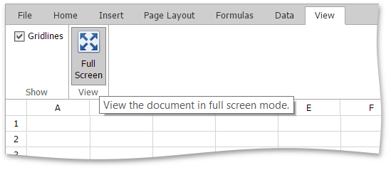

# Full Screen Mode
The **Spreadsheet** provides functionality to display worksheets in full screen mode.

To turn on full screen mode, go to the **View** tab, and then click the **Full Screen** button in the **View** group (or press F11 button).

To disable the full screen mode, click the same button.