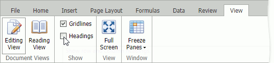

# Hide and Display Headings
You can hide row and column headings in a worksheet.

* Row headings are numbers that are displayed to the left side of the sheet.
* Column headings are letters that are displayed above columns.

Clear the **Headings** checkbox in the **View** tab's **Show** group to hide headings.

To display headings, select the **Headings** checkbox.
