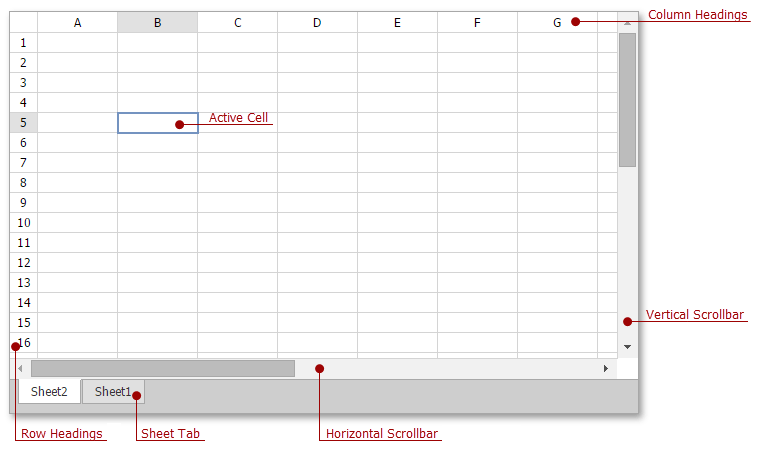
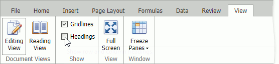

# Hide and Display Headings
**Row headings** are numbers that are displayed to the left side of the sheet.

**Column headings** are letters that are displayed above columns.

Clear the **Headings** check box in **View** tab's **Show** group to hide headings.

