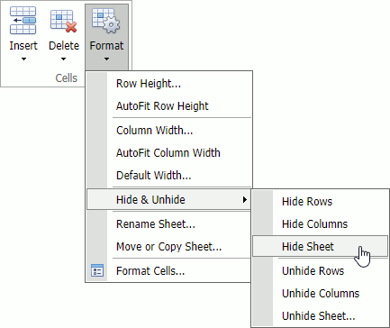

# Hide and Display Worksheets
The **Spreadsheet** provides the capability to hide worksheets in a workbook. It can be useful if you want to remove a worksheet from the **Sheet tab** bar without deleting it. By default, all worksheets are displayed on the **Sheet tab** bar.

## Hide Worksheets
To hide a worksheet do one of the following:
* On the **Home** tab, in the **Cells** group, click the **Format** button and select **Hide &amp; Unhide | Hide Sheet**. 

* Right-click a sheet tab and select the **Hide Sheet** command in the displayed context menu.

Note that this command is disabled when a workbook includes only one visible worksheet.

## Display Hidden Worksheets
To display a hidden worksheet do one of the following:

* On the **Home** tab, in the **Cells** group, click the **Format** button and select **Hide &amp; Unhide | Unhide Sheet...**.
	

* Right-click a sheet tab and select the **Unhide Sheet...** command in the displayed context menu.
	

The **Unhide** dialog box appears. Select the name of the worksheet you want to display and click **OK**.
	
