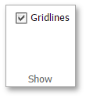

# Hide Gridlines
The **Spreadsheet** allows you to hide gridlines that are displayed on a worksheet by default.

In the **Show** group within the **View** tab, uncheck the **Gridlines** check box to hide gridlines on a worksheet.

To display gridlines, select the **Gridlines** check box.