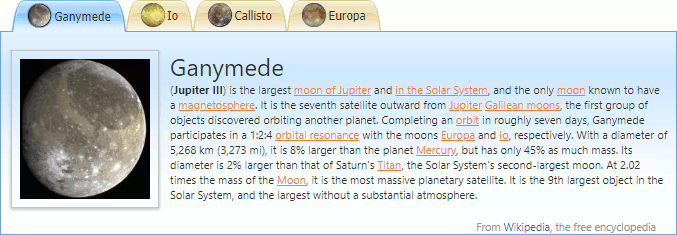

# Tab Control
This section describes the capabilities provided by the Tab Control, which is used for a presentation of tabbed interfaces.

Click tabs to switch them. An active tab is highlighted.

**Tab Scrolling**
* [Tab Scrolling](tab-control/tab-scrolling.md)