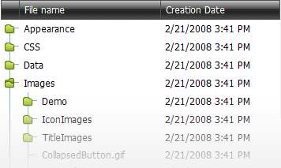

# Tree List
This section describes the capabilities the **Tree List** (multi-column tree view) provides.

&nbsp;

**Data Editing**
* [Edit Cell Values](tree-list/data-editing/edit-cell-values.md)
* [Batch Editing](tree-list/data-editing/batch-editing.md)

&nbsp;

**Data Presentation**
* [Expand and Collapse Nodes](tree-list/data-presentation/expand-and-collapse-nodes.md)
* [Sort Nodes](tree-list/data-presentation/sort-nodes.md)

&nbsp;

**Filtering**
* [Header Filter](tree-list/filtering/header-filter.md)
* [Date Range Header Filter](tree-list/filtering/date-range-header-filter.md)
* [Filter Row](tree-list/filtering/filter-row.md)
* [Search Panel](tree-list/filtering/search-panel.md)
* [Creating Complex Filter Criteria With The Filter Builder](tree-list/filtering/creating-complex-filter-criteria-with-the-filter-control.md)

&nbsp;

**Navigation and Layout**
* [Selection and Navigation](tree-list/layout-and-navigation/selection-and-navigation.md)
* [Keyboard Navigation](tree-list/layout-and-navigation/keyboard-navigation.md)
* [Reorder Nodes](tree-list/layout-and-navigation/reorder-nodes.md)
* [Reorder Columns](tree-list/layout-and-navigation/reorder-columns.md)
* [Resize Columns](tree-list/layout-and-navigation/resize-columns.md)
* [Column Chooser](tree-list/layout-and-navigation/column-chooser.md)

**Data Summaries**
* [Data Summaries](tree-list/data-summaries.md)

**Data Validation**
* [Data Validation](tree-list/data-validation.md)

**Data Export**
* [Data Export](tree-list/data-export.md)