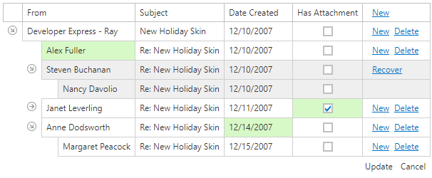
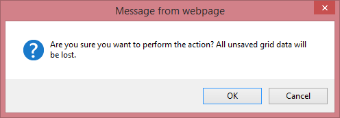

# Batch Editing
You can create new nodes, delete existing nodes, and edit individual cell values on a single page and save these changes with one click. 
* To create a new node, click the **New** button and specify field values.
* To delete a node, click the **Delete** button in the node to be deleted.
* To edit a cell value, click (or double-click) the cell and edit the value.

The modified cells are highlighted in a different color. 

To save all changes, click **Update** or click **Cancel**  to discard all the changes.

If a Tree List contains unsaved data, a confirmation message is displayed before the data is lost (e.g., when sorting the data, changing the page or closing the web page). You can choose whether to proceed and lose changes or cancel the action.

