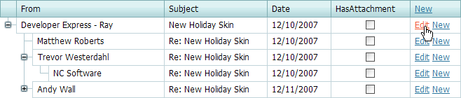
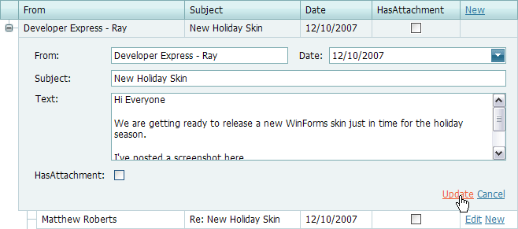
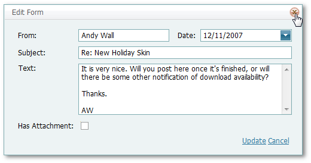

# Edit Cell Values
## Switch to Edit Mode
Click **Edit** to switch the Tree List to the edit mode.

## Save and Discard Changes
You can modify cell values and click **Update** or click **Cancel**  to discard the changes.

Click **Close** to cancel the changes made in the Edit Form.

